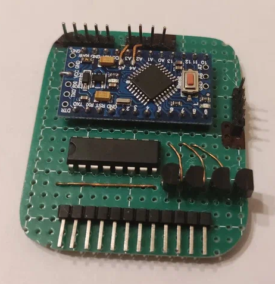
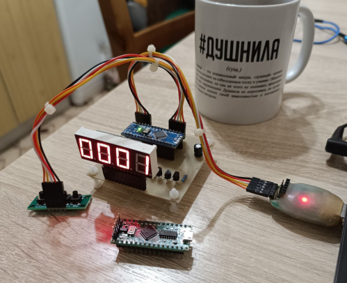

# Overview

A firmware (an Arduino sketch) written for the Arduino Nano-based electronic clock I made in 2022.

## Concept

I had made this half-baked clock and written the initial functional sketch for the ATmega328P-based Arduino Nano
knockoff board in 2022, and it works okay, but in order to improve the device's maintainability I wrote the updated
firmware and the docs. If you like this project for some reason, feel free to use the code and the docs as you please.

The sketch:
* Drives a multiplexed 7-segment display using a single 74HC595 shift register IC and
a set of 4 GPIO-driven transistors.
* Interfaces with a DS3231 RTC IC (breakout board) to track time.
* Is also compatible with Nano-style LGT8F328P boards.

## Schematic

It's like on this picture (taken from a [similar project](https://github.com/ErlingSigurdson/ErlingClock1)),
but it differs in which microcontroller pins are used and in the wiring order between the display and the 595.
The project also has an additional connection between the 595’s OE (output enable) pin and one of the GPIO pins,
which allows for brightness control via PWM. It's all reflected in the sketch.

As it's drawn, the schematic is far from perfect anyway: base drive resistors should have higher values, pull-down
resistors should be added to bases, etc. But hey, it works.

.png)

### Hint: charging circuit removal

It is common knowledge that most cheap DS3231 breakout boards have a backup battery charging circuit that is, first,
designed for rechargeable batteries (like ML2032), and second, designed rather poorly. Since I use a non-rechargeable
CR2032 battery, I followed a common advice and removed the diode and the resistor that constitute the said circuit
(removing any of them would be enough, but I removed both anyway). I suspect that it improves battery health and makes
RTC time update on backup power more reliable.

## Dependencies

See the sketch file include directives, see the links below.

## License

This stuff is licensed under the **MIT License** (see `LICENSE` [here](LICENSE)).

## Links

### Git repositories

#### This project
* [Primary repository on GitHub](https://github.com/ErlingSigurdson/ErlingClock3)
* [Backup repository on GitFlic](https://gitflic.ru/project/efimov-d-v/erlingclock3)
* [Backup repository on Codeberg](https://codeberg.org/ErlingSigurdson/ErlingClock3)

#### Drv7SegQ595 by ErlingSigurdson
* [Primary repository on GitHub](https://github.com/ErlingSigurdson/Drv7SegQ595)
* [Backup repository on GitFlic](https://gitflic.ru/project/efimov-d-v/drv7segq595)
* [Backup repository on Codeberg](https://codeberg.org/ErlingSigurdson/Drv7SegQ595)

#### SegMap595 by ErlingSigurdson
* [Primary repository on GitHub](https://github.com/ErlingSigurdson/SegMap595)
* [Backup repository on GitFlic](https://gitflic.ru/project/efimov-d-v/segmap595)
* [Backup repository on Codeberg](https://codeberg.org/ErlingSigurdson/SegMap595)

#### uButton by AlexGyver
* [Maintainer's repository](https://github.com/GyverLibs/uButton)
* [My fork](https://github.com/ErlingSigurdson/uButton)

#### GyverDS3231 by AlexGyver
* [Maintainer's repository](https://github.com/GyverLibs/GyverDS3231)
* [My fork](https://github.com/ErlingSigurdson/GyverDS3231)

### Miscellaneous

* File archive: [storage #1](https://disk.yandex.ru/d/FxXSyZChcaEdUg), [storage #2](https://drive.google.com/drive/folders/1LdPqOxuEcJZYzVOYvnO-TFDK-OlJJSPq?usp=sharing).

## Contact details

**Author** — Dmitriy Efimov aka Erling Sigurdson
* <efimov-d-v@yandex.ru>
* <erlingsigurdson1@gmail.com>
* Telegram: @erlingsigurdson
