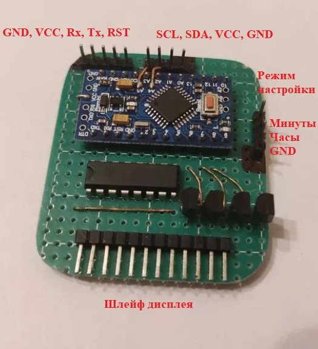
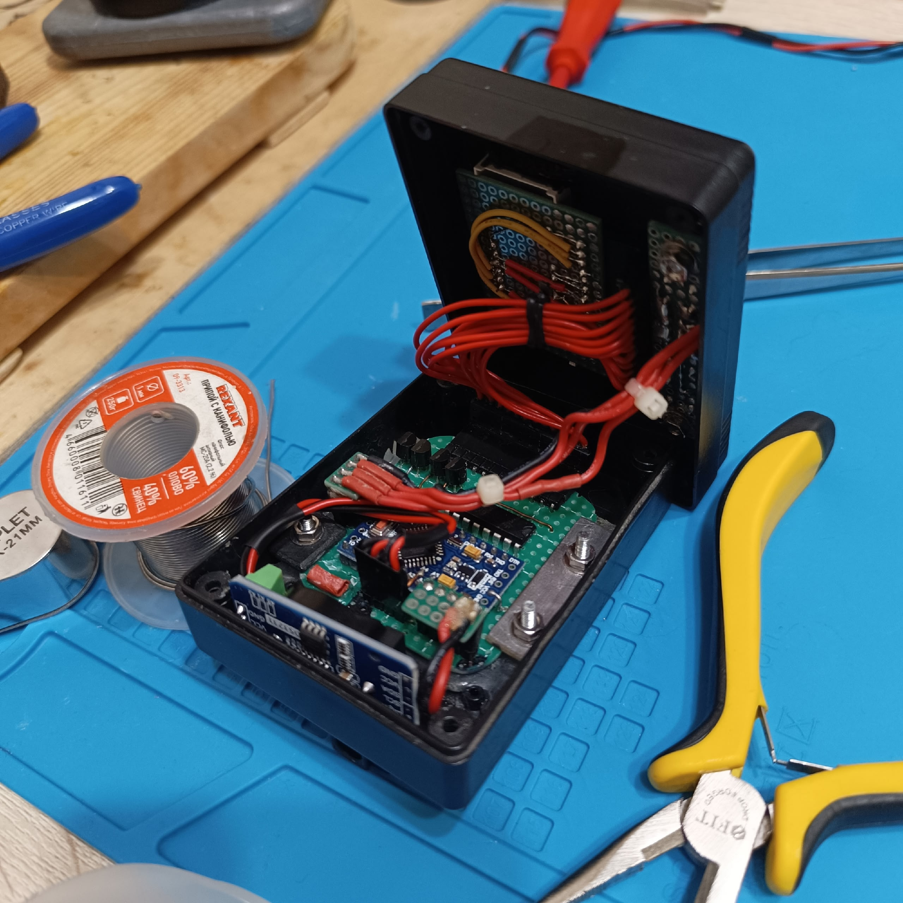

# Overview

A firmware (an Arduino sketch) written for the Arduino Pro Mini-based electronic clock I made in 2022.

## Concept

I made this clock and wrote a rookie sketch that worked somehow. Since I'd like to keep this device
working, usable and maintainable, I wrote this updated firmware just to know what my clock is running.
If you like the code for some reason, feel free to use it as you please.

## Schematic

Far from perfect: base drive resistors should have higher values, pull-down resistors should be added to bases, etc.
But hey, it works. 

.png)

## Dependencies

See the sketch file includes, see the links below.

## Links

### Git repositories

#### This project
* [Primary repository on GitHub](https://github.com/ErlingSigurdson/ErlingClock1)
* [Backup repository on GitFlic](https://gitflic.ru/project/efimov-d-v/erlingclock1)
* [Backup repository on Codeberg](https://codeberg.org/ErlingSigurdson/ErlingClock1)

#### Drv7SegQ595 by ErlingSigurdson
* [Primary repository on GitHub](https://github.com/ErlingSigurdson/Drv7SegQ595)
* [Backup repository on GitFlic](https://gitflic.ru/project/efimov-d-v/drv7segq595)
* [Backup repository on Codeberg](https://codeberg.org/ErlingSigurdson/Drv7SegQ595)

#### SegMap595 by ErlingSigurdson
* [Primary repository on GitHub](https://github.com/ErlingSigurdson/SegMap595)
* [Backup repository on GitFlic](https://gitflic.ru/project/efimov-d-v/segmap595)
* [Backup repository on Codeberg](https://codeberg.org/ErlingSigurdson/SegMap595)

#### uButton by AlexGyver
* [Maintainer's repository](https://github.com/GyverLibs/uButton)
* [My fork](https://github.com/ErlingSigurdson/uButton)

#### GyverDS3231 by AlexGyver
* [Maintainer's repository](https://github.com/GyverLibs/GyverDS3231)
* [My fork](https://github.com/ErlingSigurdson/GyverDS3231)

### Miscellaneous

* An [article](https://vk.ru/@-214685134-elektronnye-chasy-na-arduino-i-module-ds3231ds1307?subtype=primary) I wrote on this project in 2022. The pinned sketch is deprecated, and overall writing doesn't satisfy me anymore, but I don't care enough to do something about this one.

## License

This stuff is licensed under the **MIT License** (see `LICENSE` [here](LICENSE)).
